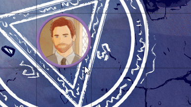

# FoundryVTT Condition Labels

Adds a label which instantly shows the currently hovered condition in the token HUD. Faster than waiting for a tooltip.

## Installation

In **Configuration and Setup** go to **Add-on Modules**->**Install Module**, then type the following URL:

`https://raw.githubusercontent.com/RikkiGibson/foundryvtt-condition-labels/master/module.json`

Then hit **Install**. Make sure to enable the module in your game world.
